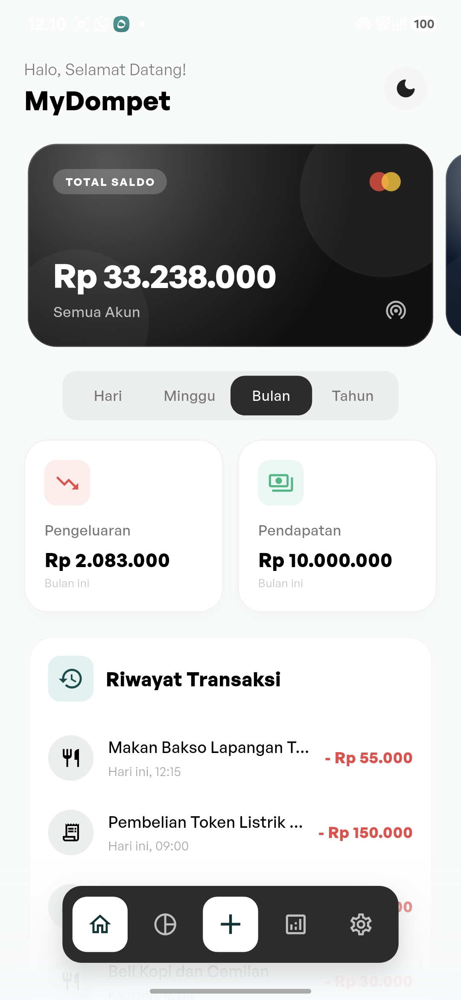
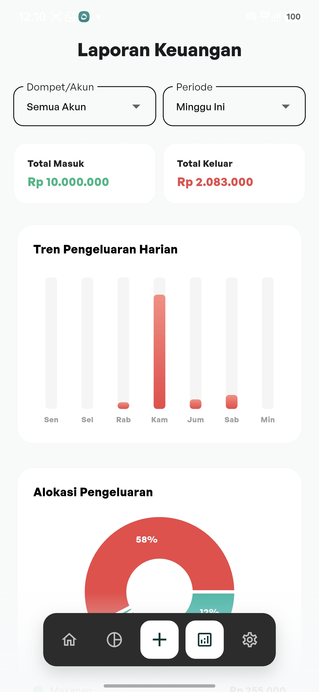
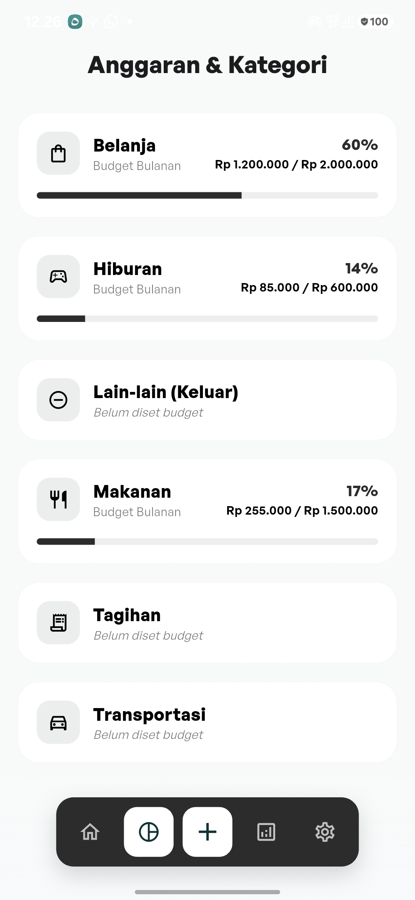

# MyDompet — Aplikasi Manajemen Keuangan Pribadi

MyDompet adalah aplikasi manajemen keuangan pribadi modern untuk perangkat mobile yang dirancang dengan performa cepat, visual premium, serta navigasi super mulus. Aplikasi ini membantu melacak pengeluaran dan pemasukan harian, menetapkan batas anggaran belanja, serta menyajikan visualisasi laporan keuangan terperinci.

---

## 📱 Screenshots
| Beranda (Mode Terang) | Laporan Keuangan | Anggaran Kategori |
| :---: | :---: | :---: |
|  |  |  |

---

## ✨ Fitur Utama
*   **Manajemen Multi-Dompet**: Tambah, ubah, dan hapus akun dompet/rekening Anda. Saldo gabungan dihitung secara real-time dan disajikan dalam bentuk kartu geser (*carousel card*).
*   **Pencatatan Cepat & Pintar (Quick Input)**: Input transaksi instan berbasis teks asisten dengan pemrosesan bahasa alami (NLP sederhana). Cukup tulis *"makan bakso 25rb"* untuk otomatis mendeteksi kategori dan nominalnya.
*   **Manajemen Anggaran (Budgeting)**: Batasi pengeluaran per kategori. Dilengkapi visualisasi progress bar interaktif untuk melacak sisa limit anggaran Anda.
*   **Grafik Laporan Interaktif**: Sajikan visualisasi pengeluaran dan pemasukan dalam bentuk diagram pai (*pie chart*) dan diagram batang (*bar chart*) yang informatif per kurun waktu (Hari, Minggu, Bulan, Tahun).
*   **Backup & Restore SQLite**: Cadangkan basis data lokal Anda ke file eksternal dan pulihkan kembali kapan saja dengan aman.
*   **Truly Floating Glassmorphism Navbar**: Bilah navigasi bawah premium dengan efek bayangan melayang murni (*pure floating capsule*) dan transisi gradasi blur halus (*progressive gradient blur*).

---

## 🛠️ Tech Stack
*   **Framework**: Flutter (Dart)
*   **State Management**: Riverpod (Notifier & AsyncNotifier)
*   **Database**: SQLite (via `sqflite`)
*   **Charting**: `fl_chart`
*   **Shader Blur**: `progressive_blur` (GLSL Fragment Shaders)
*   **Font**: Outfit & Inter (Google Fonts)

---

## ⚙️ Cara Install & Menjalankan

### Persyaratan:
*   Flutter SDK (versi `>=3.0.0`)
*   Android SDK / Xcode untuk emulator atau perangkat fisik

### Langkah-langkah:
1.  **Clone Repositori**:
    ```bash
    git clone https://github.com/Faza01/MyDompet---Aplikasi-Manajemen-Keuangan-Pribadi.git
    cd MyDompet---Aplikasi-Manajemen-Keuangan-Pribadi
    ```
2.  **Unduh Dependensi**:
    ```bash
    flutter pub get
    ```
3.  **Jalankan di Mode Debug**:
    ```bash
    flutter run
    ```
4.  **Jalankan di Mode Performa Tinggi (Profile)**:
    ```bash
    flutter run --profile
    ```
5.  **Build APK Release**:
    ```bash
    flutter build apk --release
    ```

---

## 📄 License & Usage

Copyright © 2026 Faza. All rights reserved.

This repository is source-available for **educational and reference purposes only**.

### ✅ You ARE allowed to:
- View and read the source code to learn Flutter development patterns.
- Study the architecture, code structure, and implementation approach.
- Download and use the compiled APK from [Releases](https://github.com/Faza01/MyDompet---Aplikasi-Manajemen-Keuangan-Pribadi/releases) for personal use.
- Reference small code snippets in your own learning notes with attribution.

### ❌ You are NOT allowed to:
- Copy, fork, or redistribute this source code (in whole or substantial part) as your own project.
- Rebrand, rename, or republish this application.
- Use this code (in whole or in part) for commercial purposes.
- Sell or sublicense this software or any derivative works.

If you'd like to use this project as a base for something beyond personal learning, or for any commercial purpose, please reach out for permission.
