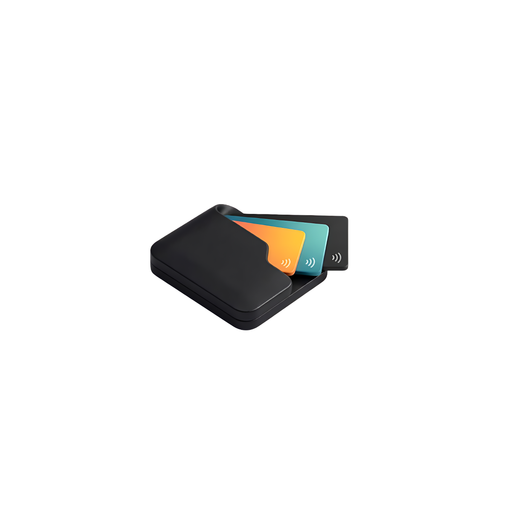

#  MyDompet — Aplikasi Manajemen Keuangan Pribadi

MyDompet adalah aplikasi manajemen keuangan pribadi modern untuk perangkat mobile yang dirancang dengan performa cepat, visual premium, serta navigasi super mulus. Aplikasi ini membantu melacak pengeluaran dan pemasukan harian, menetapkan batas anggaran belanja, serta menyajikan visualisasi laporan keuangan terperinci.

---

## 📥 Unduh Aplikasi (Download)
Unduh dan pasang berkas APK rilis resmi terbaru untuk langsung mencoba aplikasi **MyDompet** di perangkat Android Anda:

[](https://github.com/Faza01/MyDompet-Aplikasi-Manajemen-Keuangan-Pribadi/releases/latest)

👉 **[Download Di Sini](https://github.com/Faza01/MyDompet-Aplikasi-Manajemen-Keuangan-Pribadi/releases/latest)**

---

## 📱 Screenshots
| Beranda (Mode Terang) | Laporan Keuangan | Anggaran Kategori |
| :---: | :---: | :---: |
|  |  |  |

---

## ✨ Fitur Utama
*   **Manajemen Multi-Dompet**: Tambah, ubah, dan hapus akun dompet/rekening Anda. Saldo gabungan dihitung secara real-time dan disajikan dalam bentuk kartu geser (*carousel card*) premium.
*   **Pencatatan Cepat & Pintar (Quick Input NLP)**: Input transaksi instan berbasis teks asisten dengan pemrosesan bahasa alami (NLP sederhana). Cukup tulis *"makan bakso 25rb"* atau gunakan asisten suara (Voice input) untuk otomatis mendeteksi kategori dan nominalnya.
*   **Paginasi Riwayat Transaksi**: Navigasi halaman riwayat transaksi interaktif (`< 1, 2, 3, ... >`) langsung di dashboard beranda untuk mendukung performa scroll konstan 120 FPS tanpa lag.
*   **Manajemen Anggaran (Budgeting)**: Batasi pengeluaran bulanan per kategori dengan indikator bar progres interaktif.
*   **Grafik Laporan Interaktif**: Visualisasi statistik keuangan menggunakan diagram pai (*pie chart*) dan diagram batang (*bar chart*) interaktif (Hari, Minggu, Bulan, Tahun).
*   **Backup & Restore SQLite**: Ekspor database lokal ke file JSON eksternal dan pulihkan kembali kapan saja dengan mudah.
*   **Truly Floating Glassmorphism Navbar**: Navigasi bilah bawah melayang murni (*pure floating capsule*) dengan efek bayangan drop shadow dan transisi gradasi memudar yang halus.

---

## 🛠️ Tech Stack
*   **Framework**: Flutter (Dart)
*   **State Management**: Riverpod (Notifier, AsyncNotifier, NotifierProvider)
*   **Database**: SQLite (via `sqflite`)
*   **Charting**: `fl_chart`
*   **Shader Blur**: `progressive_blur` (GLSL Fragment Shaders)
*   **Font**: General Sans (Lokal)

---

## ⚙️ Cara Install & Menjalankan

### Persyaratan:
*   Flutter SDK (versi `>=3.0.0`)
*   Android SDK / Xcode untuk emulator atau perangkat fisik

### Langkah-langkah:
1.  **Clone Repositori**:
    ```bash
    git clone https://github.com/Faza01/MyDompet-Aplikasi-Manajemen-Keuangan-Pribadi.git
    cd MyDompet-Aplikasi-Manajemen-Keuangan-Pribadi
    ```
2.  **Unduh Dependensi**:
    ```bash
    flutter pub get
    ```
3.  **Jalankan di Mode Debug**:
    ```bash
    flutter run
    ```
4.  **Jalankan di Mode Performa Tinggi (Profile)**:
    ```bash
    flutter run --profile
    ```
5.  **Build APK Release (Split ABI)**:
    ```bash
    flutter build apk --release --split-per-abi
    ```

---

## 📄 Lisensi & Penggunaan

Hak Cipta © 2026 Faza. Seluruh hak cipta dilindungi undang-undang.

Repositori ini berstatus *source-available* (kode terbuka untuk dilihat) **hanya untuk tujuan edukasi dan referensi pribadi**.

### ✅ Anda DIPERBOLEHKAN untuk:
- Melihat dan membaca kode sumber untuk mempelajari pola pengembangan Flutter.
- Mempelajari arsitektur, struktur kode, dan pendekatan implementasi yang digunakan.
- Mengunduh dan menggunakan APK hasil kompilasi dari menu [Releases](https://github.com/Faza01/MyDompet-Aplikasi-Manajemen-Keuangan-Pribadi/releases) untuk penggunaan pribadi.
- Merujuk cuplikan kode kecil dalam catatan belajar Anda sendiri dengan mencantumkan sumber/atribusi.

### ❌ Anda TIDAK DIPERBOLEHKAN untuk:
- Menyalin, mendistribusikan ulang (forking/cloning) kode sumber ini (secara keseluruhan atau bagian besar) sebagai proyek Anda sendiri.
- Mengubah merek (rebranding), menamai ulang, atau menerbitkan ulang aplikasi ini.
- Menggunakan kode ini (baik sebagian maupun seluruhnya) untuk tujuan komersial.
- Menjual atau melisensikan perangkat lunak ini atau karya turunannya.

Jika Anda ingin menggunakan proyek ini di luar tujuan pembelajaran pribadi atau untuk tujuan komersial, silakan hubungi pemilik repositori untuk meminta izin tertulis.
